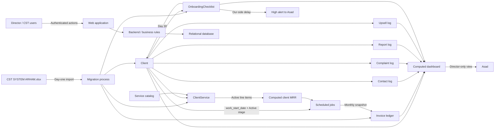
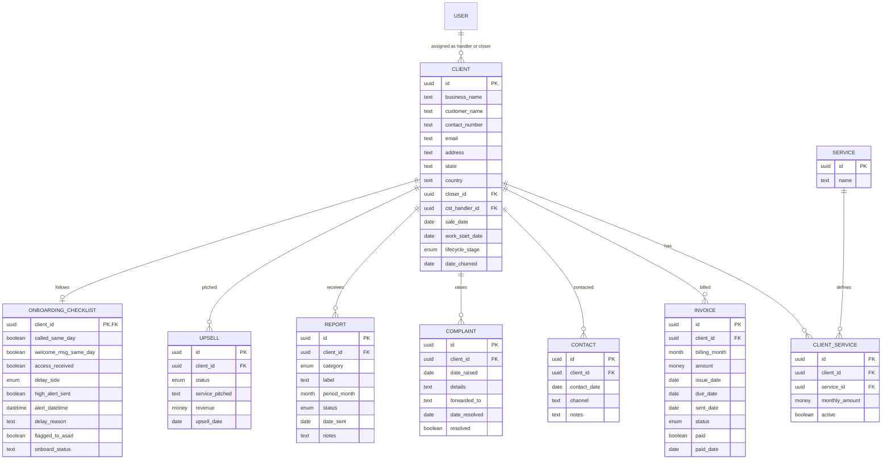
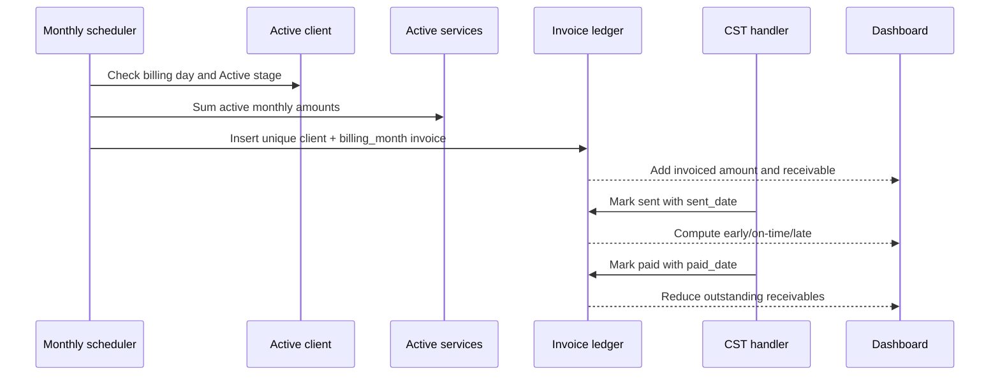
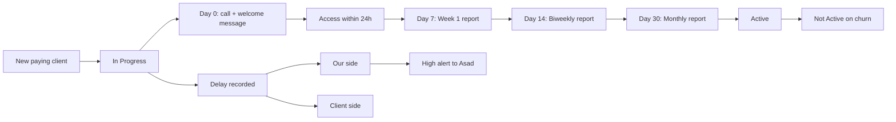

# CST CRM — Master Product and Build Roadmap

**Source document:** `CST_CRM_Build_Spec_for_Umair.docx`  
**Prepared for:** Umair (Developer)  
**Business owner:** Asad — The Fine Dudes (TFD)  
**Source date:** 19 June 2026  
**Purpose:** Replace `CST SYSTEM ARHAM.xlsx` with a multi-user, database-backed CRM.

## 1. Product outcome

The CRM must run the complete post-sale customer-success lifecycle:

1. Add a new paying client.
2. Complete the 0–30 day onboarding process.
3. Move the client automatically from `In Progress` to `Active` at Day 30.
4. Track the client's services and compute MRR.
5. Generate one permanent invoice record per billing month.
6. Let CST record invoice sending/payment, client contacts, reports, complaints, and upsells.
7. Move churned clients to `Not Active` and freeze their active duration.
8. Calculate Asad's dashboard and CST performance score only from raw records.
9. Preserve every prior month's financial history without deletion or rebuilding.
10. Support 5–10 concurrent CST users without overwriting each other's work.

### Non-negotiable outcomes

- Every monthly invoice remains permanently in the ledger.
- Dashboard values are computed and cannot be manually edited.
- System-owned fields are read-only to all human users.
- The Excel logic remains the final source of truth where the specification is ambiguous.

## 2. Scope map

| Area | Included capability | Main owner | Phase |
|---|---|---|---|
| Authentication | Director and CST Handler access | System | 1 |
| Clients | Master client data and lifecycle stage | CST | 1 |
| Services | Configurable catalog and client line items | CST | 1 |
| MRR | Per-client and portfolio calculations | System | 1 |
| Invoices | Permanent monthly ledger, sent/paid workflow | System + CST | 1 |
| Revenue history | Auto-rolling monthly view from invoices | System | 1 |
| Dashboard v1 | Revenue and invoicing metrics | System / Director | 1 |
| Onboarding | Checklist, reports, delays, graduation | CST + System | 2 |
| Contacts | Date-based client touch log | CST | 2 |
| Reports | Retention and onboarding report tracking | CST + System | 2 |
| Complaints | One row per complaint and resolution | CST | 2 |
| Upsells | Pipeline, conversion, and revenue | CST | 2 |
| Dashboard v2 | All KPI groups and performance score | System / Director | 2 |
| Alerts | High-alert notification to Asad | System | 3 |
| Exports | Operational and dashboard exports | Director | 3 |
| Audit log | Trace all important human/system changes | System | 3 |

## 3. Roles and permissions

| Action | Director — Asad | CST Handler / Manager — Arham + team | System |
|---|---:|---:|---:|
| View all client and operational data | Yes | Yes | Yes |
| Create/edit client master records | Yes | Yes | Automated where required |
| Assign CST handler | Yes | Yes | No |
| Add/edit client services | Yes | Yes | No |
| Log invoice sent/paid data | Yes | Yes | Can create monthly invoice |
| Log contacts/reports/complaints/upsells | Yes | Yes | Can create scheduled report rows |
| Complete onboarding checklist | Yes | Yes | Can graduate stage at Day 30 |
| View Director dashboard | Yes | No | Computes it |
| Set dashboard `FROM / TO` filter | Yes | No | Applies it |
| Edit computed fields | No | No | Owns calculations |
| Edit historical computed KPI values | No | No | Recomputes from raw data |

**Permission rule:** Computed values are never accepted from forms, imports, or client-side requests. They must be calculated by the backend/database.

## 4. System architecture and connections

### Recommended technical layers

- **Frontend:** Web UI for operational forms, lists, Kanban, and dashboard.
- **Backend:** Authorization, validation, business rules, transactions, and computed API responses.
- **Relational database:** Postgres, Supabase, or MySQL.
- **Scheduler/cron:** Invoice creation, report-row creation, lifecycle graduation, late-status updates, and alerts.
- **Authentication:** Role-based access for Director and CST Handler.
- **Audit layer:** Phase 3 event history for important mutations.

The source permits any toolset, including low-code, only if it supports relational data, computed fields, scheduled jobs, and role enforcement.

## 5. Relational data model

### 5.1 Relationship diagram

### 5.2 Client — master record

| Field | Type | Ownership / rule |
|---|---|---|
| `id` | UUID | System-generated primary key |
| `business_name` | Text | Required, human-entered |
| `customer_name` | Text | Human-entered |
| `contact_number` | Text | Human-entered |
| `email` | Text | Human-entered |
| `address` | Text | Human-entered |
| `state` | Text | Human-entered |
| `country` | Text | Human-entered |
| `closer` | Text/FK | Person who closed the sale |
| `cst_handler` | Text/FK | Current account owner |
| `sale_date` | Date | Drives new-signed period metric |
| `work_start_date` | Date | Required billing/lifecycle anchor |
| `lifecycle_stage` | Enum | `In Progress`, `Active`, `Not Active` |
| `date_churned` | Nullable date | Set when churned |
| `months_active` | Computed | Months from work start to today; freezes on churn date |

Recommended integrity rules:

- `date_churned` is required when stage is `Not Active` and empty otherwise.
- `work_start_date` cannot precede `sale_date` unless the Excel source confirms such cases.
- Stage changes and handler changes should be audited in Phase 3.

### 5.3 Service catalog

The service catalog must be data-driven, not hardcoded as client columns.

Seed these 14 services exactly:

1. Website
2. GMB
3. TikTok
4. Facebook
5. Instagram
6. SEO
7. Logo/Design
8. Video Editing
9. Brand Guidelines
10. LinkedIn
11. YouTube Opt
12. Community Mgmt
13. Ads Mgmt
14. Google Ads

### 5.4 ClientService — service line items

| Field | Type | Ownership / rule |
|---|---|---|
| `id` | UUID | System-generated |
| `client_id` | FK → Client | Required |
| `service_id` | FK → Service | Required |
| `monthly_amount` | Money | Human-entered contract value |
| `active` | Boolean | Controls inclusion in current MRR |

`Client MRR = SUM(monthly_amount)` for the client's active service rows.

Recommended constraint: one currently active line item per client/service unless duplicate service packages are intentionally supported.

### 5.5 Invoice — permanent financial ledger

| Field | Type | Ownership / rule |
|---|---|---|
| `id` | UUID | System-generated |
| `client_id` | FK → Client | Required |
| `billing_month` | Month (`YYYY-MM`) | Required |
| `amount` | Money | Snapshot of client MRR at generation time |
| `issue_date` | Date | Generated |
| `due_date` | Date | Anchored to work-start day-of-month |
| `sent_date` | Nullable date | Set by CST when sent |
| `status` | Enum | `Not Sent`, `Sent`, `Late` |
| `paid` | Boolean | Updated by CST |
| `paid_date` | Nullable date | Set when paid |
| `days_before_due` | Computed | `due_date - sent_date` |
| `timing` | Computed | `Early`, `On Time`, or `Late` |

Required constraints:

- Unique `(client_id, billing_month)` prevents duplicate monthly invoices.
- Historical invoice rows are never deleted during normal operation.
- The invoice amount is a monthly snapshot; later service-price changes do not rewrite it.
- `paid_date` must be present when `paid = true`.
- CST may update sent/payment facts, but may not overwrite computed timing or dashboard totals.

### 5.6 Contact — touch log

| Field | Type | Notes |
|---|---|---|
| `id` | UUID | System-generated |
| `client_id` | FK → Client | Required |
| `contact_date` | Date | Drives weekly count |
| `channel` | Text/enum | Contact method |
| `notes` | Text | Contact detail |

`contacts_this_week = COUNT(Contact)` for the client in the current week. Target: 3.

### 5.7 Complaint

| Field | Type | Notes |
|---|---|---|
| `id` | UUID | System-generated |
| `client_id` | FK → Client | Required |
| `date_raised` | Date | Required |
| `details` | Text | Required complaint detail |
| `forwarded_to` | Text/FK | Escalation owner |
| `date_resolved` | Nullable date | Resolution date |
| `resolved` | Boolean | Open/closed state |

`open complaints = COUNT(*) WHERE resolved = false`.

### 5.8 Report

One table supports both categories.

| Field | Type | Notes |
|---|---|---|
| `id` | UUID | System-generated |
| `client_id` | FK → Client | Required |
| `category` | Enum | `Retention` or `Onboarding` |
| `label` | Text/enum | Report 1, Report 2, Week 1, Biweekly, Monthly |
| `period_month` | Month | Makes monthly reset automatic |
| `status` | Enum | `Pending`, `Sent`, `Late` |
| `date_sent` | Nullable date | CST-entered |
| `notes` | Text | Optional |

Expected schedules:

- Active client: Retention Report 1 around the 7th and Report 2 around the 21st each month.
- In Progress client: Onboarding Week 1 on Day 7, Biweekly on Day 14, Monthly on Day 30.

Recommended constraints:

- Unique `(client_id, category, label, period_month)`.
- Scheduler creates required rows; status becomes late after the agreed cutoff.

### 5.9 Upsell

| Field | Type | Notes |
|---|---|---|
| `id` | UUID | System-generated |
| `client_id` | FK → Client | Required |
| `status` | Enum | `In Progress`, `Converted`, `Lost` |
| `service_pitched` | Text/FK | Proposed service |
| `revenue` | Money | Converted revenue value |
| `upsell_date` | Date | Close date; drives period metrics |

### 5.10 OnboardingChecklist

| Field | Type | Notes |
|---|---|---|
| `client_id` | FK → Client | One checklist per onboarding client |
| `called_same_day` | Boolean | Day-0 check |
| `welcome_msg_same_day` | Boolean | Day-0 check |
| `access_received` | Boolean | Expected within 24 hours |
| `delay_side` | Enum | `Our`, `Client`, `N/A` |
| `high_alert_sent` | Boolean | Alert delivery fact |
| `alert_datetime` | Nullable datetime | Delivery timestamp |
| `delay_reason` | Text | Required for a delay |
| `flagged_to_asad` | Boolean | Escalation fact |
| `onboard_status` | Text/enum | Overall onboarding state |

### 5.11 Engineering support records

These are implementation necessities or Phase 3 requirements, not explicit business fields in the document:

- `User`: identity, name, role, active status.
- `AuditLog`: actor, action, record type/id, old/new values, timestamp.
- Common timestamps: `created_at`, `updated_at`, and optionally `created_by`, `updated_by`.
- Scheduler run/idempotency log to prove invoice/report jobs did not duplicate or skip work.

## 6. End-to-end data flows

| Trigger | Reads | Writes | Computed result / destination |
|---|---|---|---|
| New paying client added | User input | Client with `In Progress`; ClientService; OnboardingChecklist | Appears in onboarding Kanban and MRR including-in-progress |
| Day-0 CST work | Client, checklist | Checklist flags and access/delay data | Onboarding progress and delay dashboard |
| Onboarding report due | Work-start date, client stage | Report row | Pending/Late onboarding report metric |
| Day 30 reached | Work-start date, checklist/client | Client stage → `Active` | Leaves onboarding lane; enters active client list and retention workflow |
| Client service added/changed | Service catalog, client | ClientService | Current client MRR recalculates |
| Monthly billing day | Active client, work-start date, active services | One Invoice row | Immutable monthly amount snapshot; revenue-history month extends |
| Invoice sent | Invoice | `sent_date`, status | Days-before-due and timing recompute; dashboard updates |
| Invoice becomes overdue unsent | Due date, current date | Status or derived state → `Late` | Late/not-sent metrics update |
| Invoice paid | Invoice | `paid`, `paid_date` | Receivables decrease; paid total increases |
| Contact logged | Client | Contact row | Weekly contact count and missed-client list update |
| Retention report sent | Report | Date/status | Report 1/2, both-sent, late metrics update |
| Complaint logged | Client | Complaint row | Total/open complaint counts update |
| Complaint resolved | Complaint | Resolved/date | Resolved count and resolution rate update |
| Upsell pitched | Client | Upsell `In Progress` | In-progress upsell count updates |
| Upsell converted/lost | Upsell | Status/revenue/date | Converted count and period revenue update |
| Client churned | Client | Stage `Not Active`, `date_churned` | Months active freezes; churn KPIs update; future invoice generation stops |
| Date filter changed | Dashboard `FROM / TO` | No raw data | Every period metric recalculates for selected range |
| Our-side onboarding delay | Checklist | Delay fields and alert facts | High-alert goes to Asad; delay KPI updates |

## 7. Business rules and computed logic

| Computed value | Exact rule from source | Data dependency |
|---|---|---|
| Months active | Months from `work_start_date` to today; use `date_churned` instead of today after churn | Client |
| Next invoice/due date | Next monthly occurrence of work-start day-of-month | Client |
| Client MRR | Sum active service amounts for that client | ClientService |
| Active MRR | Sum MRR for clients in `Active` | Client + ClientService |
| Active + in-progress MRR | Sum MRR for clients in either live stage | Client + ClientService |
| Days before due | `due_date - sent_date` | Invoice |
| Invoice timing: Early | Sent at least 5 days before due | Invoice |
| Invoice timing: On Time | Sent 1–4 days before due | Invoice |
| Invoice timing: Late | Sent on/after due, or still unsent after due | Invoice |
| Contacts this week | Contacts dated in current week; target 3 | Contact |
| Open complaints | Complaints where `resolved = false` | Complaint |
| Retention completion | Two sent reports per Active client per month | Report + Client |
| Monthly invoiced | Sum invoice amounts for selected billing month | Invoice |
| Receivables | Sum invoice amounts where `paid = false` | Invoice |
| Monthly client revenue | Sum invoice amount grouped by client and billing month | Invoice |
| Monthly total revenue | Sum invoice amount grouped by billing month | Invoice |

### Source-of-truth hierarchy

1. Invoice ledger is the financial source of truth.
2. Contact, Complaint, Report, Upsell, and Onboarding rows are the operational source records.
3. Dashboard values are read models/queries, not editable stored inputs.
4. Excel is consulted only to confirm ambiguous legacy rules and migration values.

## 8. Invoice lifecycle — critical path

### Required invoice behavior

- The job is idempotent: rerunning it cannot create a duplicate.
- Invoice amount is captured from current MRR at creation.
- Prior invoices are never rebuilt when services change.
- Rolling revenue history is a query/view over the ledger, not another editable table.
- Any month can be selected to show total invoiced, paid, and outstanding.

## 9. Onboarding lifecycle

The primary UI is a visual Kanban with the lifecycle lanes `In Progress → Active → Not Active`, backed by the Client stage rather than duplicated board data.

## 10. Dashboard specification

### 10.1 Filter behavior

- One Director-controlled `FROM / TO` date range drives all period metrics.
- Snapshot metrics ignore the period filter and show current state.
- Each metric must link or drill down to its underlying records where feasible.
- No dashboard number is manually editable.

### 10.2 Metric inventory

| Group | Metric | Type | Primary source |
|---|---|---|---|
| Client Overview | Total clients | Snapshot | Client |
| Client Overview | Active | Snapshot | Client stage |
| Client Overview | In progress | Snapshot | Client stage |
| Client Overview | Churned all-time | Snapshot/all-time | Client stage/date churned |
| Client Overview | New signed | Period | Client sale date |
| Client Overview | Churned | Period | Client date churned |
| Client Overview | Clients at 4+ months | Snapshot | Computed months active |
| Client Overview | Average months active | Snapshot | Computed months active |
| Engagement | Clients contacted 3×+ this week | Current week | Contact |
| Engagement | Clients missed | Current week | Contact + eligible clients |
| Invoicing | Invoices sent 5+ days early | Period/month | Invoice |
| Invoicing | Invoices late | Current/period | Invoice |
| Invoicing | Invoices not sent | Current/period | Invoice |
| Invoicing | Total invoiced this month | Current month | Invoice |
| Invoicing | Unpaid receivables | Snapshot | Invoice |
| Reports | Retention Report 1 sent | Period/month | Report |
| Reports | Retention Report 2 sent | Period/month | Report |
| Reports | Reports late | Current/period | Report |
| Reports | Both sent 2/2 | Period/month | Report grouped by client |
| Reports | Onboarding Week 1 sent | Period | Report |
| Reports | Onboarding Biweekly sent | Period | Report |
| Reports | Onboarding Monthly sent | Period | Report |
| Complaints | Total logged | Period | Complaint date raised |
| Complaints | Resolved | Period/current | Complaint |
| Complaints | Still open | Snapshot | Complaint |
| Complaints | Resolution rate | Period/current | Complaint |
| Upsell | Converted | Period | Upsell date/status |
| Upsell | Upsell revenue | Period | Upsell date/revenue |
| Upsell | In progress | Snapshot | Upsell status |
| Work-start delays | Our side | Period/current | OnboardingChecklist |
| Work-start delays | Client side | Period/current | OnboardingChecklist |
| Revenue | MRR — Active | Snapshot | Client + ClientService |
| Revenue | MRR — Active + In Progress | Snapshot | Client + ClientService |
| Revenue | Upsell revenue | Period | Upsell |
| Revenue | Total revenue | Period | Invoice + agreed upsell treatment |
| Revenue | Revenue by month | Historical | Invoice ledger |

### 10.3 CST Performance Score

| Component | Weight | Formula |
|---|---:|---|
| Invoice Timing | 20% | `% clients with invoice sent ≥5 days early` |
| Client Contact Rate | 25% | `% Active + In-Progress clients contacted 3×+ this week` |
| Retention Report Rate | 20% | `reports sent ÷ (active clients × 2)` |
| Complaint Resolution | 20% | `resolved complaints ÷ total complaints` |
| Retention Rate | 15% | `clients at ≥4 months ÷ active clients` |

`Overall score = Invoice × 0.20 + Contact × 0.25 + Reports × 0.20 + Complaints × 0.20 + Retention × 0.15`

Bonus rules:

- Score `≥ 90`: Full KPI bonus.
- Score `60–89`: Partial bonus at the score percentage.
- Score `< 60`: No bonus and performance review.

## 11. Migration plan

### 11.1 Input scope

- 61 rows from Client Database.
- Approximately 13 rows from Onboarding.
- Historical monthly values from Excel columns `BH → CE`.
- Legacy `Dashboard`, `Onboarding`, `Client Database`, and `How To Use` logic must be reviewed.

### 11.2 Mapping

| Excel data | Destination | Rule |
|---|---|---|
| Client identity/contact/address fields | Client | Clean, validate, and deduplicate |
| Closer and CST owner | Client | Map to users or controlled names |
| Sale/work-start/churn dates | Client | Normalize dates and derive stage |
| 14 service columns and amounts | Service + ClientService | One line item per populated service |
| Onboarding status/checks | OnboardingChecklist | One checklist per in-progress client |
| Monthly revenue `BH → CE` | Invoice | One row per client/month with a value |
| Excel `[AUTO]` columns | Do not import | Recalculate in CRM |
| Excel dashboard totals | Do not import | Recalculate from normalized raw rows |

### 11.3 Migration execution

1. Take a read-only backup of the source workbook.
2. Profile every sheet, column, formula, enum, blank, duplicate, and invalid date.
3. Agree mapping and cleanup rules with Asad.
4. Import users/service catalog.
5. Import and deduplicate Clients.
6. Import ClientService rows.
7. Import OnboardingChecklist rows.
8. Backfill one Invoice per populated client/month from `BH → CE`.
9. Recompute all `[AUTO]` values inside the CRM.
10. Reconcile counts and financial totals against Excel month-by-month.
11. Obtain Asad's sign-off before cutover.
12. Freeze Excel for operational editing and retain it as an archive.

### 11.4 Mandatory reconciliation report

- Source vs imported Client count.
- Source vs imported onboarding count.
- Source vs imported active/inactive counts.
- Service totals by service and client.
- MRR by client and portfolio.
- Invoice count and amount by billing month.
- Churn dates and months-active samples.
- All rejected/skipped rows with reasons.

## 12. Delivery roadmap

### Phase 0 — discovery and rule lock

**Dependencies:** Source DOCX plus `CST SYSTEM ARHAM.xlsx`, Asad availability.

Deliverables:

- Inspect every workbook sheet, formula, validation list, and monthly column.
- Resolve the open decisions in Section 14.
- Approve ERD, field dictionary, role matrix, and KPI formulas.
- Define timezone, currency, weekly boundary, due-date edge cases, and alert channel.
- Produce migration mapping and reconciliation template.
- Prepare prioritized backlog and UI wireframes.

**Exit gate:** Asad signs off all ambiguous calculations and migration mappings.

### Phase 1 — financial MVP

Deliverables:

- Authentication and two roles.
- Client CRUD and lifecycle fields.
- Service catalog with 14 seed values.
- ClientService line items and computed MRR.
- Permanent Invoice ledger.
- Monthly idempotent invoice generation.
- Sent/paid workflow and timing calculations.
- Monthly revenue history view.
- Dashboard v1: revenue and invoicing metrics.
- Phase 1 migration tools and test import.

**Exit gate:** Any month can be selected without changing/deleting another month; totals reconcile to source data.

### Phase 2 — full CST operations

Deliverables:

- Lifecycle Kanban.
- Onboarding checklist and auto-graduation.
- Onboarding and retention report schedules.
- Contact log and weekly target logic.
- Complaint and resolution workflow.
- Upsell pipeline.
- Full dashboard metric inventory.
- CST Performance Score and bonus tier.
- Complete production migration.

**Exit gate:** Every source acceptance criterion passes with migrated data and role testing.

### Phase 3 — controls and scale

Deliverables:

- High-alert notification to Asad.
- Data/dashboard exports.
- Audit log.
- Scheduler monitoring and failure alerts.
- Operational hardening, backup/restore checks, and performance tuning.

**Exit gate:** Key actions are traceable, jobs are observable, and recovery is tested.

## 13. Acceptance and test matrix

| ID | Acceptance requirement | Verification |
|---|---|---|
| AC-01 | New client completes 0–30 day pipeline | Create a client, complete checklist/reports, simulate Day 30 |
| AC-02 | Client auto-graduates to Active at Day 30 | Scheduler test and stage assertion |
| AC-03 | Every Active client gets a monthly invoice | Run billing job for eligible clients |
| AC-04 | Duplicate job run creates no duplicate invoice | Run same job twice; assert unique row |
| AC-05 | CST can mark invoice Sent and Paid | Permission and state-transition tests |
| AC-06 | Previous invoices are never deleted/replaced | Change service MRR; verify old invoice unchanged |
| AC-07 | Any month shows invoiced, paid, outstanding | Query several imported/generated months |
| AC-08 | Revenue history extends automatically | Advance billing month and run scheduler |
| AC-09 | All dashboard KPIs come from raw data | Reconcile each card with independent query |
| AC-10 | Computed fields cannot be edited | UI, API, and database authorization tests |
| AC-11 | Contacts roll automatically by week | Test dates across week boundary |
| AC-12 | Reports roll automatically by month | Test period rows across month boundary |
| AC-13 | Open complaint count is exact | Create/resolve multiple complaint rows |
| AC-14 | Director and CST role boundaries work | Role-based route/API tests |
| AC-15 | 61 clients and history migrate cleanly | Reconciliation report and sign-off |
| AC-16 | Approximately 13 onboarding records migrate | Reconcile with onboarding sheet |
| AC-17 | Churn freezes months active | Set churn date; advance clock; compare value |
| AC-18 | Performance score uses exact weights | Fixture-based calculation tests |
| AC-19 | 5–10 CST users do not overwrite data | Concurrent update/conflict test |
| AC-20 | Our-side delay can alert Asad | Trigger and verify delivery/audit record |

## 14. Decisions required before schema/formula lock

These items are not fully defined in the source and must be confirmed against Excel or by Asad:

| Priority | Decision | Why it matters |
|---|---|---|
| Blocker | Provide `CST SYSTEM ARHAM.xlsx` | It is explicitly named as the source of truth for ambiguous rules and migration |
| Blocker | Confirm whether ~13 onboarding clients overlap the 61 client rows | Determines unique migration count: 61 or approximately 74 |
| Blocker | Define invoice first-month behavior for an `In Progress` paying client | Auto-generation is stated for Active clients, but onboarding clients are already paying |
| Blocker | Define `issue_date` and exact due-date relationship | Only due-date anchoring is specified |
| Blocker | Define billing-day handling for work-start dates 29, 30, or 31 | Short months need an explicit rule |
| Blocker | Confirm currency, tax, discounts, credits, refunds, and invoice correction/void rules | Financial model currently contains only one amount |
| High | Define exact calendar-month calculation for `months_active` | Partial months and day boundaries can change KPIs |
| High | Define week start/end and business timezone | Weekly contacts and scheduled jobs depend on it |
| High | Define retention-report cutoffs; source says “~7th” and “~21st” | Late status cannot use approximate dates |
| High | Define unsent-before-due timing value | The source defines late only after due and does not name the pre-due timing state |
| High | Confirm whether invoice `status` is stored or fully derived | Avoid inconsistent status/sent/due combinations |
| High | Define zero-denominator behavior in score formulas | No complaints/active clients must not cause invalid scores |
| High | Confirm eligible client set for contact and report KPIs | Source mixes Active and Active + In Progress depending on metric |
| High | Define period semantics for “resolved complaints” | Could filter by raised date or resolved date |
| High | Define `total revenue` formula and whether upsells are included once or recurring | Dashboard label is specified but formula is not |
| High | Decide whether converted upsell revenue becomes a ClientService line item | Affects future MRR and invoices |
| High | Define service-price effective dating/history | Current `active` flag cannot reconstruct prior service contracts, though invoice snapshots remain correct |
| Medium | Define allowed contact channels | Enables clean reporting |
| Medium | Define closer/handler user model and reassignment history | Text vs FK is left open |
| Medium | Define checklist `onboard_status` values | Current field type is unspecified |
| Medium | Define high-alert delivery channel and retry/escalation | Email, SMS, in-app, or another channel |
| Medium | Define dashboard drill-down/export formats | Phase 3 export scope is unspecified |
| Medium | Define audit-log retention and audited events | Phase 3 names audit log without policy |
| Medium | Define concurrency conflict behavior | Needed to guarantee CST users do not overwrite each other |
| Medium | Define data validation and required fields beyond business name | Prevents bad migration/new data |

## 15. Implementation backlog by dependency

1. Approve rules and data dictionary.
2. Set up database, migrations, authentication, roles, and environments.
3. Build User, Client, Service, and ClientService.
4. Implement MRR and lifecycle calculations.
5. Build Invoice ledger and uniqueness/immutability controls.
6. Build and monitor monthly invoice scheduler.
7. Build revenue-history queries and Dashboard v1.
8. Build onboarding checklist, report generation, and Day-30 graduation.
9. Build contacts, complaints, reports, and upsells.
10. Build Dashboard v2 and performance score.
11. Build migration scripts and reconciliation reports.
12. Execute dry-run migration, user acceptance testing, and corrections.
13. Execute production cutover.
14. Add alerts, exports, audit logs, monitoring, and recovery tests.

## 16. Definition of done

The CRM is done only when:

- Every requirement in AC-01 through AC-20 passes.
- Financial totals reconcile month-by-month with the approved source workbook.
- No computed field is writable through UI or API.
- Schedulers are idempotent and observable.
- Director and CST permissions are verified.
- Migrated records and rejected-row logs are signed off by Asad.
- Backups and recovery are tested.
- The team is trained and Excel is retained only as a read-only archive.

## 17. Source-document coverage checklist

| Source section | Covered here |
|---|---|
| 1. What you're building | Sections 1–2 |
| 2. Users & roles | Section 3 |
| 3. Core data model | Section 5 |
| 4. Monthly invoice fix | Sections 6 and 8 |
| 5. Computed logic | Section 7 |
| 6. Onboarding pipeline | Section 9 |
| 7. Dashboard and score | Section 10 |
| 8. Migration | Section 11 |
| 9. Suggested stack | Section 4 |
| 10. Acceptance criteria | Section 13 |
| 11. Build phases | Section 12 |

This roadmap preserves every functional item in the supplied DOCX and separates explicit requirements from engineering recommendations and unresolved business decisions.
